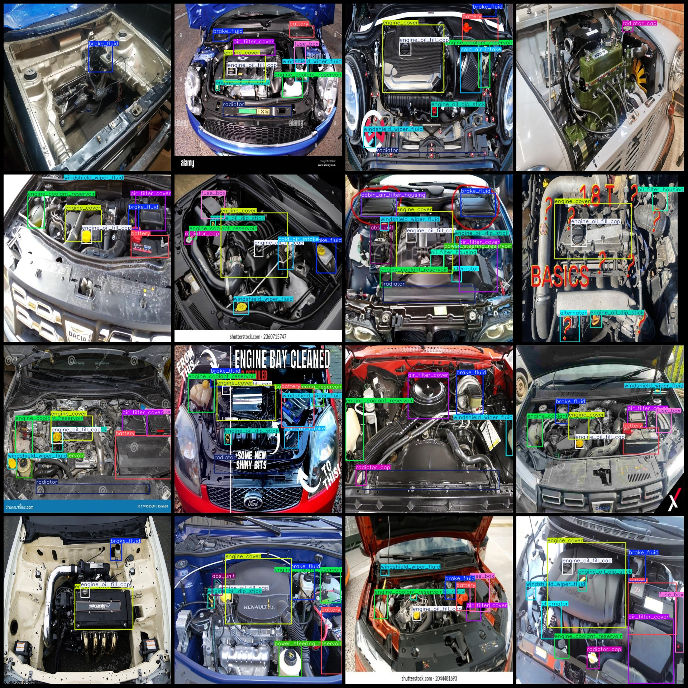
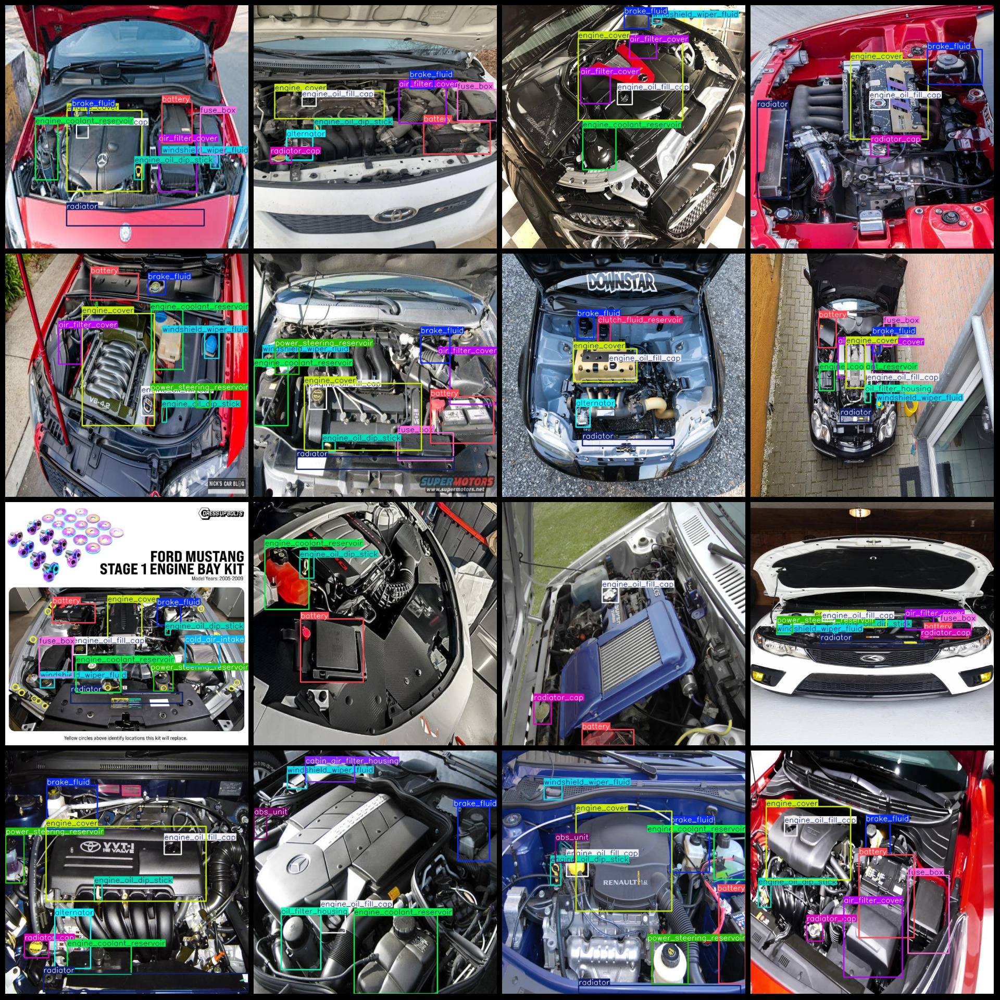

# Automotive Engine Chamber Components Front Car Cover Engine Area Equipment Inspection Dataset VOC+YOLO Format 622 Categories

```python
import os
import glob
from labelImg import LabelImg

def read_image_file(image_path):
    image = Image.open(image_path)
    return image

def read_json(file_path):
    with open(file_path, 'r') as f:
        return json.load(f)

def read_yolo_txt(file_path):
    txt_content = ""
    with open(file_path, 'r') as f:
        for line in f:
            txt_content += line.strip() + "
"
    return txt_content

def main():
    dataset_dir = 'VOC+YOLO'
    data_folder = os.path.join(dataset_dir, 'images')
    data_json_folder = os.path.join(dataset_dir, 'json')
    data_yolo_folder = os.path.join(dataset_dir, 'yolo')

    images = glob.glob(os.path.join(data_folder, '*.jpg'))
    jsons = glob.glob(os.path.join(data_json_folder, '*.json'))
    yolos = glob.glob(os.path.join(data_yolo_folder, '*.txt'))

    total_img_count = len(images)
    total_json_count = len(jsons)
    total_yolo_count = len(yolos)

    print("Total images:", total_img_count)
    print("Total json files:", total_json_count)
    print("Total yolo files:", total_yolo_count)

    labelImg.init()

    for i, (image_path, json_path, yolo_path) in enumerate(zip(images, jsons, yolos)):
        image = read_image_file(image_path)
        json_data = read_json(json_path)
        yolo_data = read_yolo_txt(yolo_path)

        # Extract class name from JSON file
        class_name = json_data['class']

        # Draw bounding box around the image
        labelImg.draw_rectangle(image, (0, 0), (image.width, image.height), color='blue', outline=True)

        # Write the class name to the corresponding text file
        with open(os.path.join(data_json_folder, f'class_{class_name}.json'), 'w') as json_file:
            json_file.write(str(class_name))

        # Write the class name to the corresponding text file
        with open(os.path.join(data_yolo_folder, f'class_{class_name}.txt'), 'a') as yolo_file:
            yolo_file.write(str(class_name))

if __name__ == '__main__':
    main()
```

Image





Here is a pay link on Stripe ( https://buy.stripe.com/3cs8yP7sY87d0vu9AB ). Please contact me lonlonago@foxmail.com after funding $89, and I will send you a complete data files , thank you!


